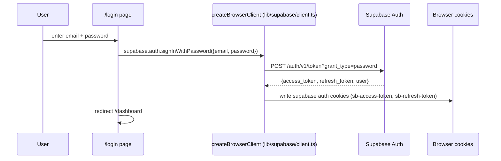
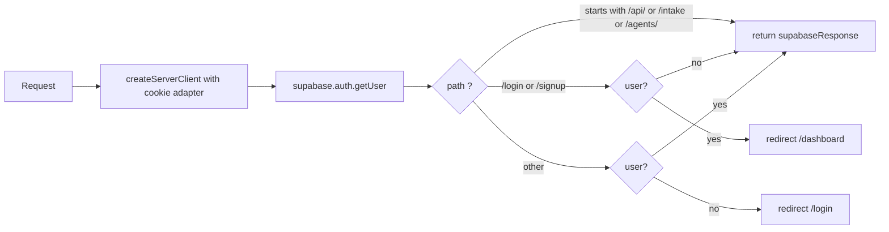
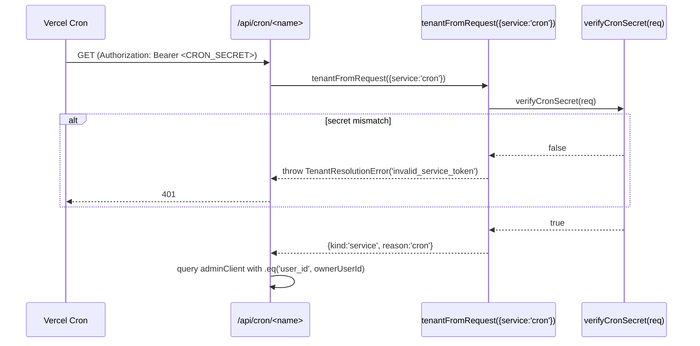
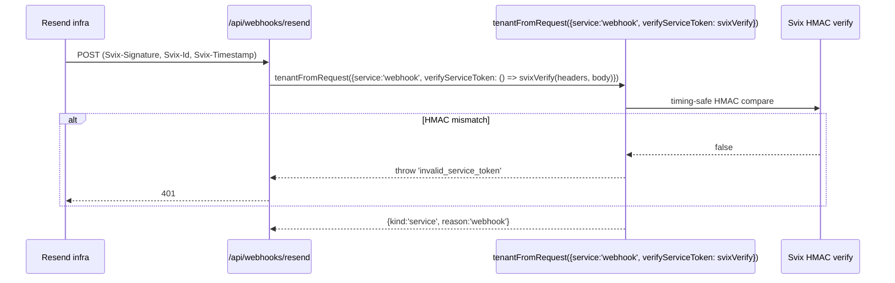

# Auth Flow -- GAT-BOS CRM

## Context

GAT-BOS uses Supabase Auth (email + password) with row-level security on every multi-tenant table, three Supabase client factories chosen by call site, and a single tenant-context resolver (`tenantFromRequest`) that owns all auth-derived state.

The architecture was rewritten end-to-end in **Slice 7A** (shipped 2026-04-30). Before Slice 7A, RLS gated on `auth.jwt() ->> 'email' = 'alex@alexhollienco.com'` and server code read `OWNER_USER_ID` from env. Slice 7A:

- Introduced `public.accounts` (single Alex seed row with `slug='alex-hollien'`).
- Added `user_id uuid NOT NULL DEFAULT auth.uid()` + FK to `auth.users` across 15 tables.
- Rewrote 21 RLS policies from email-based to column-based (`user_id = auth.uid()`).
- Deleted `OWNER_USER_ID` env var and `ALEX_EMAIL` constant from `src/`.
- Hard-broke `writeEvent()` so `userId` is a required input (no env fallback).
- Made `tenantFromRequest()` the only tenant resolver, with explicit failure modes.

This document describes the resulting auth surface. **It is descriptive, not prescriptive.** No recommendation is made to change auth behavior. Slice 7A.5 (Migration History Reconciliation) is in flight; the auth perimeter is off-limits to the architecture pass.

---

## High-level diagram

```mermaid
flowchart TD
  classDef boundary fill:#fef3c7,stroke:#a16207,stroke-width:2px;
  classDef session fill:#e0f2fe,stroke:#0369a1,stroke-width:1px;
  classDef bypass fill:#fee2e2,stroke:#b91c1c,stroke-width:1px;

  Browser[Browser request]
  Middleware[middleware.ts]:::boundary

  Auth{public route?}
  AuthGate{user signed in?}

  Login[/login -> redirect/]:::session
  Page[Authenticated page]:::session
  PublicPage[/intake or /agents/[slug]/]:::bypass
  Api[/api/*/]
  Tenant[tenantFromRequest]:::boundary

  UserCtx[kind='user', userId, accountId]:::session
  ServiceCtx[kind='service', reason]:::bypass

  ServerSb[lib/supabase/server.ts<br/>anon-key + cookies<br/>RLS bound]:::session
  AdminSb[lib/supabase/admin.ts<br/>service-role<br/>RLS BYPASSED]:::bypass
  BrowserSb[lib/supabase/client.ts<br/>anon-key<br/>RLS bound]:::session

  Browser --> Middleware
  Middleware --> Auth
  Auth -- yes --> PublicPage
  Auth -- yes /api/* --> Api
  Auth -- no --> AuthGate
  AuthGate -- no --> Login
  AuthGate -- yes --> Page

  Page --> ServerSb
  Page -.client component.-> BrowserSb
  Api --> Tenant
  Tenant -- session path --> UserCtx
  Tenant -- cron / webhook / intake / background --> ServiceCtx
  UserCtx --> ServerSb
  UserCtx --> AdminSb
  ServiceCtx --> AdminSb
  AdminSb -. must scope by user_id or account_id .-> AdminSb
```

The middleware authorizes browser navigation. The API routes authorize themselves through `tenantFromRequest()`, which selects between the user path (Supabase session cookie -> account lookup) and the service path (cron secret, webhook HMAC, intake token, internal background token). The three Supabase client factories are picked per call site based on auth context.

---

## 1. Sign-in flow

Routes: `(auth)/login`, `(auth)/signup`. Both use Supabase Auth's email-and-password provider directly via `createBrowserClient()` from `@supabase/ssr`.



`signup` follows the same path with `signUp({email, password})`. Email confirmation is configurable per Supabase project. `README.md` documents the demo flow including a `seed_data(user_id)` SQL function for fresh installs.

---

## 2. Middleware -- request entry

`src/middleware.ts` runs on every request that matches `((?!_next/static|_next/image|favicon.ico|.*\.(?:svg|png|jpg|jpeg|gif|webp)$).*)`. Its job is two-fold:

1. **Refresh the Supabase session cookies** by hydrating a server client from the request cookies and forwarding any rotated cookies onto the response.
2. **Authorize the page request** by checking the user against a public-route allow-list and an auth-page list.



The public-route allow-list:

```
/api/*       -- API routes auth themselves; middleware would drop service callers
/intake      -- public form
/agents/*    -- public agent landing pages (Julie, Fiona, Denise)
```

Anything else is gated. If the user is signed in and lands on `/login` or `/signup`, they are redirected to `/dashboard` to avoid the auth-page bounce.

The middleware uses `@supabase/ssr` `createServerClient` with a cookie adapter. The adapter writes any rotated tokens onto the response, so subsequent requests on the same connection see fresh cookies.

`src/middleware.ts` is 66 lines. Read it directly when in doubt.

---

## 3. Three Supabase client factories

Every Supabase access in the app goes through one of three factories. Choosing the wrong one is the most common auth bug class.

| File | Function | Auth context | RLS | Allowed in |
|---|---|---|---|---|
| `src/lib/supabase/server.ts` | `await createClient()` | anon-key + auth cookies (Next.js `cookies()`) | RLS enforced by user_id | Server Components, Server Actions, route handlers that need session-scoped reads |
| `src/lib/supabase/client.ts` | `createClient()` | anon-key from `NEXT_PUBLIC_*` envs | RLS enforced by user_id | Client components, useQuery hooks, browser code |
| `src/lib/supabase/admin.ts` | `adminClient` (singleton) | service-role key | RLS BYPASSED | API route handlers, Server Actions, cron + webhook + intake. **Caller must scope rows manually.** |

### server.ts (28 lines, full text)

```ts
import { createServerClient } from "@supabase/ssr";
import { cookies } from "next/headers";

export async function createClient() {
  const cookieStore = await cookies();
  return createServerClient(
    process.env.NEXT_PUBLIC_SUPABASE_URL!,
    process.env.NEXT_PUBLIC_SUPABASE_ANON_KEY!,
    {
      cookies: {
        getAll() { return cookieStore.getAll(); },
        setAll(cookiesToSet) {
          try {
            cookiesToSet.forEach(({ name, value, options }) =>
              cookieStore.set(name, value, options)
            );
          } catch {
            // setAll called from a Server Component; ignore.
          }
        },
      },
    }
  );
}
```

The `try/catch` on `setAll` exists because Next.js does not allow Server Components to mutate cookies; the call is a no-op there because the middleware already refreshes the session.

### client.ts (9 lines, full text)

```ts
import { createBrowserClient } from "@supabase/ssr";
export function createClient() {
  return createBrowserClient(
    process.env.NEXT_PUBLIC_SUPABASE_URL!,
    process.env.NEXT_PUBLIC_SUPABASE_ANON_KEY!
  );
}
```

### admin.ts (9 lines, full text)

```ts
// Service-role client for API routes. Bypasses RLS. Never use in browser code.
import { createClient } from "@supabase/supabase-js";
export const adminClient = createClient(
  process.env.NEXT_PUBLIC_SUPABASE_URL!,
  process.env.SUPABASE_SERVICE_ROLE_KEY!
);
```

`adminClient` is a singleton because it has no per-request state (no cookies). It bypasses RLS by design. **Every read or write through `adminClient` must scope rows manually**, typically via `.eq('user_id', userId)` or `.eq('account_id', accountId)`. Failing to scope is a tenant-isolation bug.

---

## 4. tenantFromRequest -- the canonical resolver

`src/lib/auth/tenantFromRequest.ts` (143 lines) is the single entry point for resolving any request to its tenant context. Every API route handler that touches user-scoped data calls it.

### Type contract

```ts
export type TenantContext =
  | { kind: "user"; userId: string; accountId: string }
  | { kind: "service"; reason: "cron" | "webhook" | "intake" | "background" };

export type TenantErrorCode =
  | "no_session"
  | "no_account"
  | "invalid_service_token"
  | "ambiguous_context";

export class TenantResolutionError extends Error {
  code: TenantErrorCode;
  // ...
}
```

### Two paths

**User path (default):**
1. `createClient()` (server.ts) -> `supabase.auth.getUser()`.
2. If no user -> throw `TenantResolutionError('no_session')`.
3. SELECT from `accounts` WHERE `owner_user_id = user.id` AND `deleted_at IS NULL`.
4. If no account -> throw `TenantResolutionError('no_account')`.
5. Return `{kind: 'user', userId, accountId}`.

**Service path (opt-in via `opts.service`):**
1. `service: 'cron'` -> `verifyCronSecret(req)` (Bearer CRON_SECRET, timing-safe). Pass -> `{kind: 'service', reason: 'cron'}`. Fail -> `TenantResolutionError('invalid_service_token')`.
2. `service: 'webhook' | 'intake' | 'background'` -> caller must supply `verifyServiceToken: () => boolean | Promise<boolean>`. The resolver does NOT know about Svix HMAC, Gmail watch, INTERNAL_API_TOKEN, etc. -- the caller plugs in. Pass -> `{kind: 'service', reason}`. Fail -> `TenantResolutionError('invalid_service_token')`.

### Critical invariant

Service contexts have NO `accountId`. Service-role callers use `adminClient` (which bypasses RLS) and MUST scope rows explicitly via `.eq('account_id', ...)` or `.eq('user_id', ...)`. They cannot defer to RLS. This is enforced by convention plus code review, not by the type system.

### Test override hook

`__setTenantOverride()` is stripped in production builds (`process.env.NODE_ENV === 'production'` early-returns). Tests use it to simulate user / service / error contexts without touching cookies or env vars. Six unit tests live at `src/lib/auth/__tests__/tenantFromRequest.test.ts`.

---

## 5. api-auth.ts -- service token gates

`src/lib/api-auth.ts` (80 lines) provides four helpers used by API routes either standalone or composed inside `tenantFromRequest`:

| Function | Purpose | Returns |
|---|---|---|
| `requireApiToken(request)` | Bearer INTERNAL_API_TOKEN gate (used by skill / integration callers) | `NextResponse 401` or `null` on success |
| `verifyCronSecret(request)` | Bearer CRON_SECRET timing-safe equality check | `boolean` |
| `verifySession()` | Confirms a Supabase user is signed in | `Promise<boolean>` |
| `verifyBearerOrSession(request)` | Combined: returns true if cron OR session is valid | `Promise<boolean>` |

All three Bearer-token checks use Node's `timingSafeEqual` to avoid string-comparison timing attacks. Length mismatch returns false without invoking `timingSafeEqual` (the function throws on length mismatch).

`verifySession` is tenant-agnostic post-Slice-7A: it only confirms the session is valid, not that it belongs to a specific user. Tenant scoping is a separate concern handled by `tenantFromRequest` + RLS.

---

## 6. RLS philosophy

Every multi-tenant table has the same shape post-Slice-7A:

```sql
ALTER TABLE <table> ADD COLUMN user_id uuid NOT NULL DEFAULT auth.uid()
  REFERENCES auth.users(id);
CREATE INDEX <table>_user_id_idx ON <table> (user_id);

CREATE POLICY <table>_owner_read ON <table> FOR SELECT
  USING (user_id = auth.uid());
CREATE POLICY <table>_owner_write ON <table> FOR ALL
  USING (user_id = auth.uid())
  WITH CHECK (user_id = auth.uid());
```

15 tables received this in Slice 7A: `ai_cache`, `attendees`, `email_drafts`, `emails`, `error_logs`, `event_templates`, `events`, `message_events`, `messages_log`, `morning_briefs`, `projects`, `relationship_health_config`, `relationship_health_scores`, `relationship_health_touchpoint_weights`, `templates`. Plus `oauth_tokens` got a text->uuid type fix on its existing `user_id` column.

3 tables had pre-existing `user_id` columns and only got policy rewrites (from email-based to column-based): `ai_usage_log`, `oauth_tokens`, `project_touchpoints`.

### Anon-key clients enforce RLS

When `lib/supabase/server.ts` or `lib/supabase/client.ts` issues a query, Supabase resolves `auth.uid()` from the JWT carried in the cookie or anon-key request. RLS evaluates `user_id = auth.uid()` and rows owned by other users are silently filtered.

### Service-role clients bypass RLS

`lib/supabase/admin.ts` uses `SUPABASE_SERVICE_ROLE_KEY`. Service role bypasses RLS entirely. Two consequences:

1. The caller MUST scope rows manually: `.eq('user_id', userId)` or `.eq('account_id', accountId)`. Forgetting a scope is the most dangerous bug class in this codebase.
2. RLS errors NEVER surface in service-path code. The "row not visible" failure mode of RLS becomes a "row not in result set" failure mode here. Callers must test for `data === null` and handle accordingly.

### Service-role usage table

Every service-role caller in the repo. The right column is the manual scope they apply.

| File | Service caller | Manual scope |
|---|---|---|
| `lib/activity/writeEvent.ts` | activity ledger writes | `user_id` injected from input |
| `lib/captures/actions.ts` | promoteCapture, capture promotion | `user_id` from caller |
| `lib/intake/process.ts` | public intake processing | `user_id` from account owner lookup |
| `lib/hooks/post-creation.ts` + `handlers/*` | post-creation hooks (project, contact, event) | `user_id` from row data |
| `lib/messaging/send.ts` | sendMessage orchestration | `user_id` from caller |
| `lib/campaigns/actions.ts` | autoEnrollNewAgent, runner step writes | `user_id` from caller |
| `lib/ai/_client.ts` | ai_usage_log writes | `userId` required input |
| `lib/ai/_budget.ts` | budget RPC + warning events | `userId` required input |
| `lib/ai/_cache.ts` | ai_cache reads + writes | (cache key is feature + sha256, scoped by RLS via user_id column on cached row) |
| `lib/rate-limit/check.ts` | rate_limits counter | not tenant-scoped (operational table, deny-all RLS, RPC is SECURITY DEFINER) |
| `app/api/calendar/sync-in/route.ts` | hourly Google Calendar pull | `user_id` from account owner |
| `app/api/cron/morning-brief/route.ts` | daily brief assembly | `user_id` from account owner |
| `app/api/cron/campaign-runner/route.ts` | every-15-min campaign tick | `user_id` from enrollment row |
| `app/api/webhooks/resend/route.ts` | inbound delivery events | `user_id` from `messages_log` row via FK |
| `app/api/email/approve-and-send/route.ts` | draft state machine | `user_id` from draft row |
| `app/api/email/generate-draft/route.ts` | Claude-driven draft generation | `user_id` from email row |

---

## 7. Public route surface

Three surfaces bypass middleware auth:

| Path | Auth | Why |
|---|---|---|
| `/api/*` | route handlers self-auth via `tenantFromRequest` | Service callers (cron, webhook, intake) need to reach the route without a session. Middleware would drop them. |
| `/intake` | public form, rate-limited, honeypot, Zod validation | Agents share this URL; no Alex-side auth required. |
| `/agents/[slug]` | static (SSG) public pages | Per-agent landing pages with JSON-LD + Open Graph for share previews. |

`/api/email/test`, `/api/inbox/items`, `/api/morning/latest`, etc. still require a session even though middleware lets them through; the route handler self-checks via `verifySession()` or `tenantFromRequest()`.

---

## 8. Cron + webhook auth flow



Webhook flow (Resend example):



Inside the route, the handler reads `messages_log_id` from the payload, looks up `user_id` via FK, and writes `message_events` rows scoped by that user_id. RLS does not apply (service-role) so the manual scope is the only barrier.

---

## 9. Multi-tenant readiness

The `accounts` table is the tenant root. Today there is exactly one row (Alex). The system is single-tenant in practice but multi-tenant in design:

- `tenantFromRequest()` looks up `accounts` by `owner_user_id` and returns `accountId`.
- Every multi-tenant table has `user_id` (the operator) plus the option of a parallel `account_id` once multi-account adds land.
- RLS uses `user_id = auth.uid()` -- already correct for multi-user.

To add a second account: create a new auth.users row, create a new accounts row with `owner_user_id` pointing to it, and the existing infrastructure already isolates the data. No code changes required for the main tenant flow; only seed-data + UI for the account picker would need to evolve.

This document does not recommend that step. It describes the current shape so future work knows the constraints.

---

## 10. What changed in Slice 7A (audit trail)

For future agents who land on the codebase and want to understand why auth looks the way it does:

| Before Slice 7A | After Slice 7A |
|---|---|
| RLS checked `auth.jwt() ->> 'email' = 'alex@alexhollienco.com'` | RLS checks `user_id = auth.uid()` |
| Server code read `OWNER_USER_ID` from env (single hardcoded UUID) | Server code reads userId from session (via tenantFromRequest), row data, or explicit handler argument |
| `writeEvent()` accepted `userId` from env fallback | `writeEvent()` requires `userId` as input. Hard break. |
| `ALEX_EMAIL` constant in `lib/constants.ts` gated drafts UI | Constant deleted. UI no longer email-gated. |
| `oauth_tokens.user_id` was `text` (with legacy 'alex' literal) | Migrated to `uuid` with FK to `auth.users` |
| `verifySession()` checked Alex's specific email | `verifySession()` is tenant-agnostic; tenant scoping moved to `tenantFromRequest` + RLS |

Final greps in `src/`: `OWNER_USER_ID = 0`, `ALEX_EMAIL = 0`. Anyone reintroducing those patterns should be flagged immediately.

---

## Cross-references

- Module map: `system-map.md`
- Per-flow sequence diagrams: `data-flow.md`
- Off-limits files (the auth perimeter): `technical-debt-hotspots.md` and `ai-agent-guide.md`
