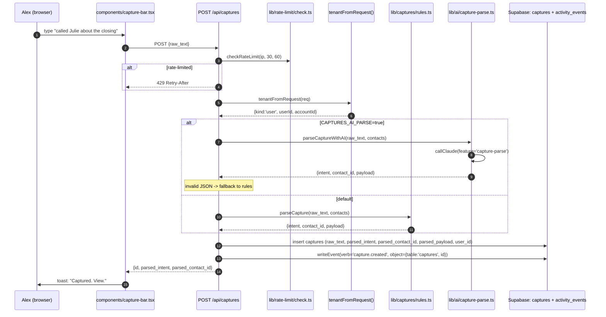
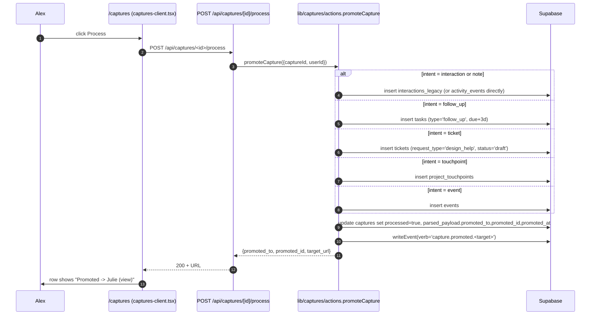
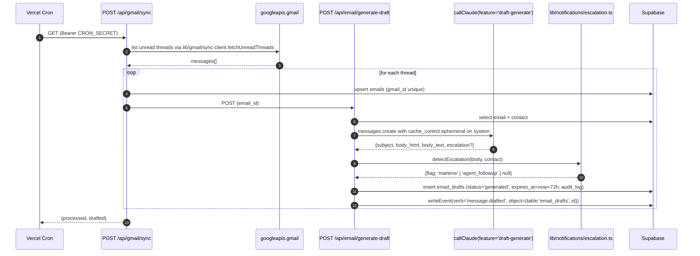
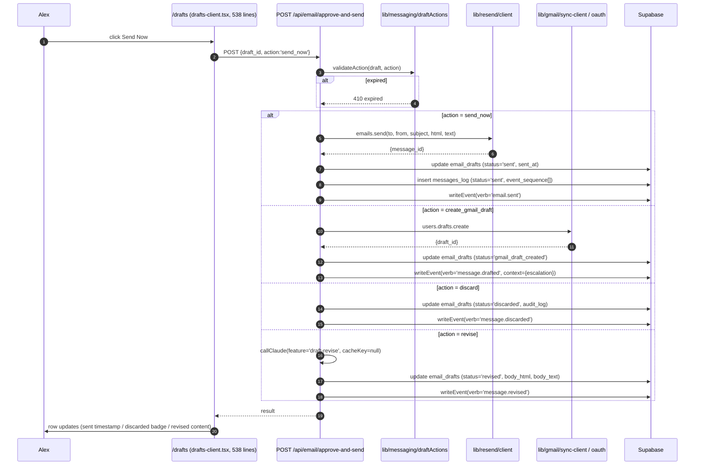
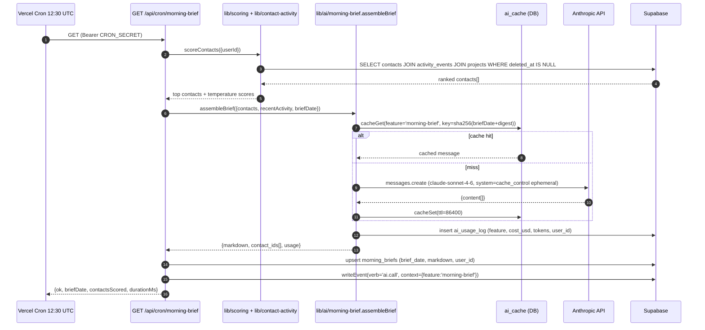
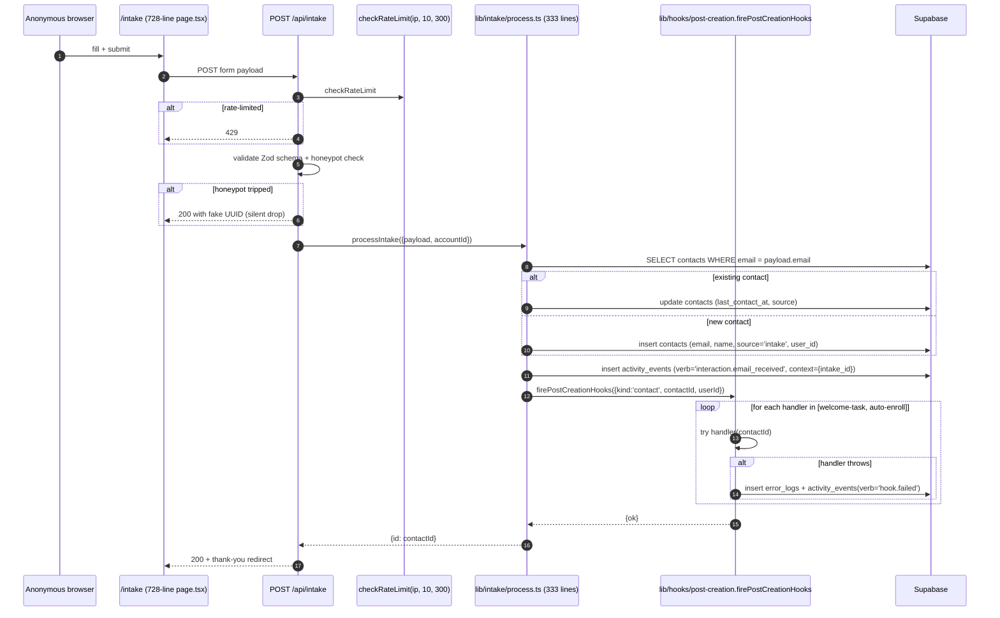
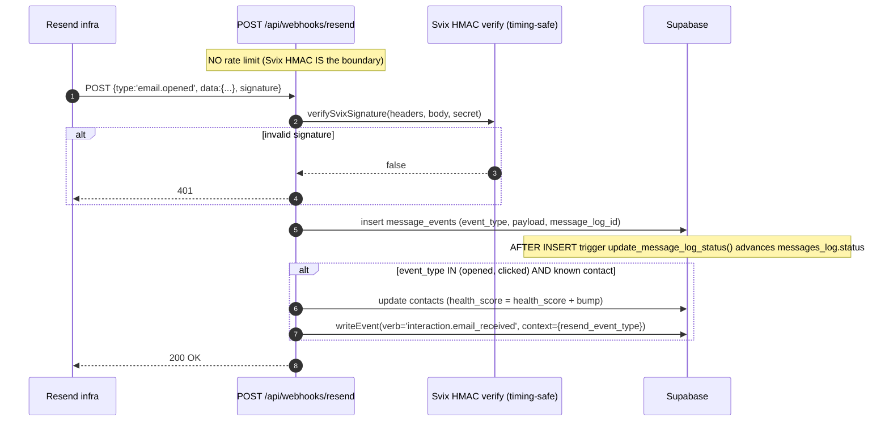
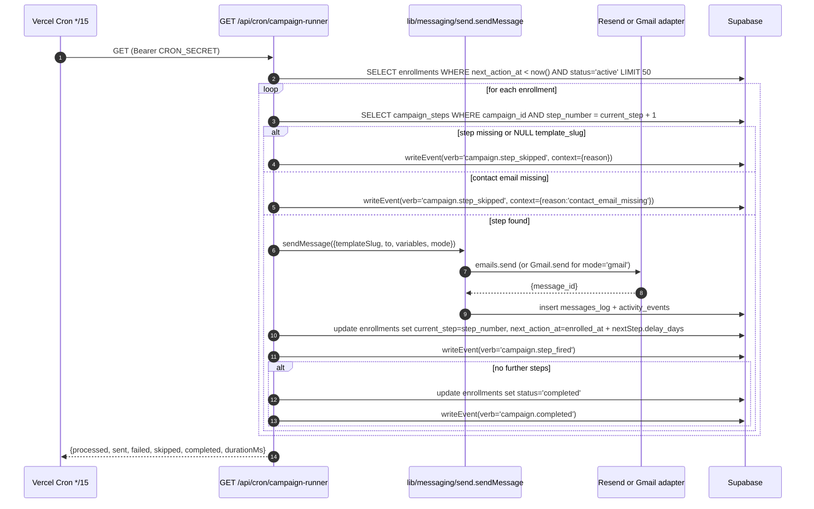

# Data Flow -- GAT-BOS CRM

## Context

This document traces eight representative end-to-end flows through GAT-BOS, from request entry to durable side effect. Each flow is a sequence diagram with the canonical files involved, the Supabase client choice, the external service touched, and the activity-events emission.

The eight flows cover every major surface in the system:

1. **Capture create** -- universal capture bar -> rule parser (or AI) -> Supabase
2. **Capture promote** -- promotion state machine to one of 5 downstream targets
3. **Email draft generate** -- Gmail thread sync -> Claude generate -> draft persisted
4. **Email approve-and-send** -- 4-action state machine with idempotency guards
5. **Morning brief cron** -- contact ranking -> Claude narrative -> persisted brief
6. **Intake submit** -- public form -> rate-limit -> contact upsert -> hooks fan-out
7. **Calendar sync-in** -- hourly Google Calendar pull -> upsert -> hook fire
8. **Resend webhook** -- HMAC verify -> message_events -> health-score bump

Routing source: `~/crm/vercel.json` (cron declarations), `~/crm/src/app/api/**/route.ts` (every handler), and the lib helpers under `~/crm/src/lib/`. All file:line references were verified in the same architecture pass that produced this document.

A ninth campaign-runner trace is included as an addendum because campaigns sit slightly outside the rest of the request taxonomy (cron-driven, multi-recipient, multi-step).

---

## Cross-flow conventions

Every flow respects a small set of invariants. Read these once; they apply throughout.

| Invariant | Source |
|---|---|
| All server writes that need RLS bypass route through `adminClient` (`src/lib/supabase/admin.ts`). | Slice 7A. |
| All session-aware reads route through `createClient()` (`src/lib/supabase/server.ts`), which carries the auth cookies and is RLS-bound. | Standing pattern. |
| All browser reads route through `createClient()` (`src/lib/supabase/client.ts`), RLS-bound to the signed-in user. | Standing pattern. |
| Tenant context comes from `tenantFromRequest()` (`src/lib/auth/tenantFromRequest.ts`). User path -> `{userId, accountId}`. Service path -> `{kind:'service', reason}` with no `accountId`; the caller MUST scope rows manually with `.eq('account_id', ...)` or by `user_id`. | Slice 7A. |
| All user-observable side effects emit one row to `activity_events` via `writeEvent()` (`src/lib/activity/writeEvent.ts`). Verb is from the `ActivityVerb` union (40 verbs). | Slice 1. |
| Rate-limited public routes (`/api/intake`, `/api/captures`, `/api/captures/[id]/process`) call `checkRateLimit()` (`src/lib/rate-limit/check.ts`). Fail-open on RPC error. | Slice 3A. |
| Anthropic calls go through `callClaude()` (`src/lib/ai/_client.ts`) which composes budget guard, prompt cache, retry, and `ai_usage_log` write. | Slice 6. |
| Cron handlers gate on `verifyCronSecret(request)` from `src/lib/api-auth.ts`. | Standing pattern. |
| Webhooks gate on provider-specific HMAC. Resend uses Svix HMAC-SHA256 with timing-safe equality. | `src/app/api/webhooks/resend/route.ts:230 lines`. |

---

## 1. Capture create

A user types into the universal capture bar (`src/components/capture-bar.tsx`, mounted on every authenticated page from `(app)/layout.tsx`). On submit, the bar POSTs to `/api/captures`. The route runs the rule parser by default; with `CAPTURES_AI_PARSE=true` it runs the Claude parser instead and falls back to the rule parser on any failure.



**Key files:** `src/app/api/captures/route.ts:122 lines`, `src/lib/captures/rules.ts`, `src/lib/ai/capture-parse.ts:177 lines`, `src/lib/rate-limit/check.ts`, `src/lib/activity/writeEvent.ts`.

**Failure modes:** rate-limit hit returns 429 with `Retry-After`. Parser failure (rule or AI) does NOT block the insert; the capture lands with `parsed_intent='unprocessed'` and the user processes it later. Claude budget exceeded falls through to the rule parser.

**Activity verbs emitted:** `capture.created`. Sometimes also `capture.classified` if the AI parser flags a clean intent.

---

## 2. Capture promote

A capture in `parsed_intent IN ('interaction','note','follow_up','ticket')` can be promoted to a real downstream row. The user clicks **Process** on `/captures` (or `Cmd+K` -> Process). POST `/api/captures/[id]/process` calls `promoteCapture()` (`src/lib/captures/actions.ts:531 lines`) which is a state machine over five targets.



**Guards:**
- Already-processed capture -> 409 with the existing `promoted_id` (idempotent).
- `interaction` / `note` / `follow_up` with no contact match -> 400 "Needs a contact" + UI swaps Process button for "Needs contact" pill (BLOCKERS.md item 2026-04-22 tracks the inline contact picker fix).
- `ticket` allowed with no contact (tickets.contact_id is nullable).

**Key files:** `src/app/api/captures/[id]/process/route.ts:112 lines`, `src/lib/captures/actions.ts:531 lines` (the largest lib file; god-file candidate), `src/components/(app)/captures/captures-client.tsx`.

---

## 3. Email draft generate

Three crons hit `/api/gmail/sync` per day (15:00, 19:00, 23:00 UTC). For each unread thread, the route calls Gmail to fetch the thread payload, then POSTs internally to `/api/email/generate-draft` (or queues that work) with the thread context. Generate-draft assembles a system prompt + thread context + reply guidance, calls `callClaude(feature='draft-generate')`, validates the model response, and persists an `email_drafts` row with audit log.



**Key files:** `src/app/api/gmail/sync/route.ts`, `src/app/api/email/generate-draft/route.ts:280 lines`, `src/lib/gmail/sync-client.ts:255 lines`, `src/lib/ai/draft-revise.ts:168 lines`, `src/lib/notifications/escalation.ts`.

**Idempotency:** generate-draft checks for an existing non-discarded `email_drafts` row keyed on `email_id`; returns the existing draft on duplicate call. `emails.gmail_id` is UNIQUE; sync upserts on that.

**Escalation flags:** Marlene routing (escalate to a human handler) and `agent_followup` (the contact requires a personal reply, not a templated one). Both surface as colored badges on `/drafts`.

---

## 4. Email approve-and-send (state machine)

The drafts queue at `/drafts` shows generated drafts. Each row supports four actions: **send_now** (Resend), **create_gmail_draft** (Gmail draft, escalation path), **discard** (soft cancel), **revise** (AI rewrite). The route accepts both Bearer CRON_SECRET and a session cookie for dual-auth.



**Key files:** `src/app/api/email/approve-and-send/route.ts:346 lines`, `src/lib/messaging/draftActions.ts:250 lines` (with `draftActions.test.ts:418 lines`), `src/lib/resend/client.ts`, `src/lib/gmail/sync-client.ts`.

**Idempotency:** `email_drafts.status` enforces one terminal transition per draft. Audit log appends in order; sender can verify each state transition.

---

## 5. Morning brief cron

`/api/cron/morning-brief` fires at 12:30 UTC daily (5:30 AM Phoenix). It scores all contacts via SQL window functions (`scoreContacts()`), passes the top-N + recent activity_events into `assembleBrief()` (a single Claude call with prompt cache enabled), and persists the resulting markdown into `morning_briefs` with a 24-hour DB cache key.



**Two-layer cache:** Anthropic prompt cache (5-min server-side, automatic when `cache_control` is set on the system prompt) + `ai_cache` DB row (24-hour TTL). The DB cache covers cross-process reuse; the prompt cache covers in-flight prefix reuse during a single rendering session.

**Key files:** `src/app/api/cron/morning-brief/route.ts:182 lines`, `src/lib/ai/morning-brief.ts:184 lines`, `src/lib/ai/_client.ts:203 lines`, `src/lib/ai/_cache.ts`, `src/lib/scoring/temperature.ts`.

**Budget guard:** before the Anthropic call, `_budget.checkBudget()` reads `current_day_ai_spend_usd` RPC. Hard cap at `AI_DAILY_BUDGET_USD` (default 5.00). Soft cap at 80% writes one `activity_events` row per (feature, Phoenix calendar day) with verb `ai.budget_warning`.

---

## 6. Intake submit (public route)

Agents fill the form at `/intake`. Public: no auth, rate-limited 10 per 5 minutes per IP. Honeypot field detects naive bots. On valid submit: contact upsert by email -> hooks fire (welcome task, auto-enrollment) -> activity_events row.



**Service path:** `tenantFromRequest({service:'intake', verifyServiceToken})` returns `{kind:'service', reason:'intake'}` with no `accountId`. `processIntake` looks up the account owner explicitly and uses `account_id` for scoping.

**Key files:** `src/app/api/intake/route.ts:87 lines`, `src/lib/intake/process.ts:333 lines` (with 251-line test suite), `src/lib/hooks/post-creation.ts`, `src/lib/hooks/handlers/contact-created.ts`, `src/lib/hooks/handlers/contact-auto-enroll.ts`.

**Hook isolation:** each handler runs in its own try/catch. One handler failure does not cascade. Failed handlers write `error_logs` row + `activity_events(verb='hook.failed')` so the intake itself succeeds even if a follow-on handler errors.

---

## 7. Calendar sync-in (hourly cron)

`/api/calendar/sync-in` fires hourly. Pulls Google Calendar events from `now-1h .. now+7d`, upserts on `gcal_event_id`, and fires the event-created hook for new rows. The route also accepts session calls for manual re-sync. A `ROLLBACK_CAL_SYNC` env var is a kill switch.

```mermaid
sequenceDiagram
  autonumber
  participant Cron as Vercel Cron hourly
  participant API as GET /api/calendar/sync-in
  participant GCal as googleapis.calendar
  participant Hooks as firePostCreationHooks
  participant DB as Supabase
  Cron->>API: GET (Bearer CRON_SECRET)
  API->>API: check ROLLBACK_CAL_SYNC; if set -> 200 noop
  API->>GCal: listEvents(timeMin=now-1h, timeMax=now+7d)
  GCal-->>API: events[]
  loop for each event
    API->>DB: upsert events ON CONFLICT (gcal_event_id) DO UPDATE
    alt new row
      API->>DB: writeEvent(verb='event.created')
      API->>Hooks: firePostCreationHooks({kind:'event', eventId, userId})
      alt event has contact_id but no project_id
        Hooks->>DB: writeEvent(verb='event.contact_only')
      else event has project_id
        Hooks->>DB: insert project_touchpoints (touchpoint_type='event')
        Hooks->>DB: writeEvent(verb='event.hook_fired')
      end
    end
  end
  API-->>Cron: {pulled, upserted, skipped, reasons}
```

**Key files:** `src/app/api/calendar/sync-in/route.ts:176 lines`, `src/lib/calendar/client.ts`, `src/lib/hooks/handlers/event-created.ts`.

**Idempotency:** upsert on the unique `gcal_event_id` column. Re-runs of the same window are safe.

---

## 8. Resend webhook -> message_events

Resend posts delivery / open / click / bounce events to `/api/webhooks/resend`. The route verifies Svix HMAC-SHA256 with timing-safe equality and 5-minute replay tolerance, then persists `message_events` rows. A `messages_log_status_sync` AFTER-INSERT trigger on `message_events` advances `messages_log.status` (queued -> sent -> delivered -> opened -> clicked; bounced and complained set status=bounced and are sticky terminal). On open / click events for a known contact, the route also bumps the contact's health score.



**Key files:** `src/app/api/webhooks/resend/route.ts:230 lines`, schema `messages_log` + `message_events` per `~/crm/SCHEMA.md`.

**Why no rate limit:** the route is called by Resend's infra at unpredictable bursts during normal email activity. Rate-limiting would drop legitimate deliveries. The HMAC signature is the boundary; rate-limit would add no security.

---

## 9. Campaign runner (every 15 min)

`/api/cron/campaign-runner` is a 15-minute tick that processes due `campaign_enrollments`. It scopes each tick to 50 enrollments to bound runtime. For each enrollment whose `next_action_at` is in the past, it resolves the next step's template, renders + sends via `sendMessage()` (Slice 4 messaging abstraction), advances `current_step`, and computes the next `next_action_at` from `enrolled_at + delay_days`.



**Scheduling re-key (Slice 5A correction):** `next_action_at` is computed as `enrolled_at + step.delay_days`, NOT `now() + step.delay_days`. With existing campaigns whose step rows carry delay_days = 0/3/7/14, this yields a Day 0 / 3 / 7 / 14 cadence relative to enrollment, regardless of how often the runner ticks.

**Key files:** `src/app/api/cron/campaign-runner/route.ts:360 lines`, `src/lib/campaigns/actions.ts`, `src/lib/messaging/send.ts:211 lines`, `src/lib/messaging/render.ts`.

---

## Trace summary table

| Flow | Entry | Auth | Client factory | Activity verbs |
|---|---|---|---|---|
| 1 Capture create | POST /api/captures | session + rate-limit | `adminClient` (write) | capture.created, capture.classified |
| 2 Capture promote | POST /api/captures/[id]/process | session + rate-limit | `adminClient` | capture.promoted.<target> |
| 3 Email draft generate | cron /api/gmail/sync -> POST /api/email/generate-draft | Bearer CRON_SECRET | `adminClient` | message.drafted, ai.call |
| 4 Approve and send | POST /api/email/approve-and-send | Bearer or session | `adminClient` | email.sent / message.drafted / message.revised |
| 5 Morning brief | cron /api/cron/morning-brief | Bearer CRON_SECRET | `adminClient` | ai.call (and budget warnings if soft cap hit) |
| 6 Intake submit | POST /api/intake | public + rate-limit | `adminClient` | interaction.email_received, contact.hook_fired |
| 7 Calendar sync-in | cron /api/calendar/sync-in | Bearer CRON_SECRET | `adminClient` | event.created, event.hook_fired, event.contact_only |
| 8 Resend webhook | POST /api/webhooks/resend | Svix HMAC | `adminClient` | interaction.email_received |
| 9 Campaign runner | cron /api/cron/campaign-runner | Bearer CRON_SECRET | `adminClient` | campaign.step_fired, campaign.step_skipped, campaign.completed |

---

## Cross-references

- Auth + tenant resolution: `auth-flow.md`
- Module map: `system-map.md`
- Rate-limit + budget guard internals: `dependency-analysis.md`
- AI capability inventory: `dependency-analysis.md` and `ai-agent-guide.md`
